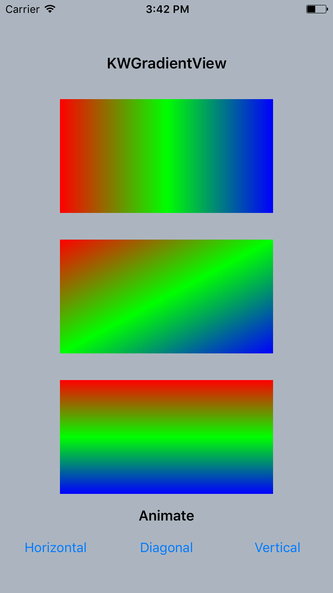

# KWGradientView



## Features

- [x] Horizontal, vertical & diagonal gradients
- [x] Animate gradients by changing colors 

## Requirements

- iOS 8.0 or later
- Swift 3.0

## Installation

KWGradientView is available through [CocoaPods](http://cocoapods.org). To install
it, simply add the following line to your Podfile:

```ruby
pod "KWGradientView"
```
## How to use

All the methods in the pod are implemented in `GradientsViewController.swift` for your reference.

## Meta

Maintained by [KeepWorks](http://www.keepworks.com/)

## Contributing

Bug reports and pull requests are welcome on GitHub at https://github.com/keepworks/KWGradientView.

## License

KWGradientView is available under the [MIT License](http://opensource.org/licenses/MIT). See the LICENSE file for more info.
